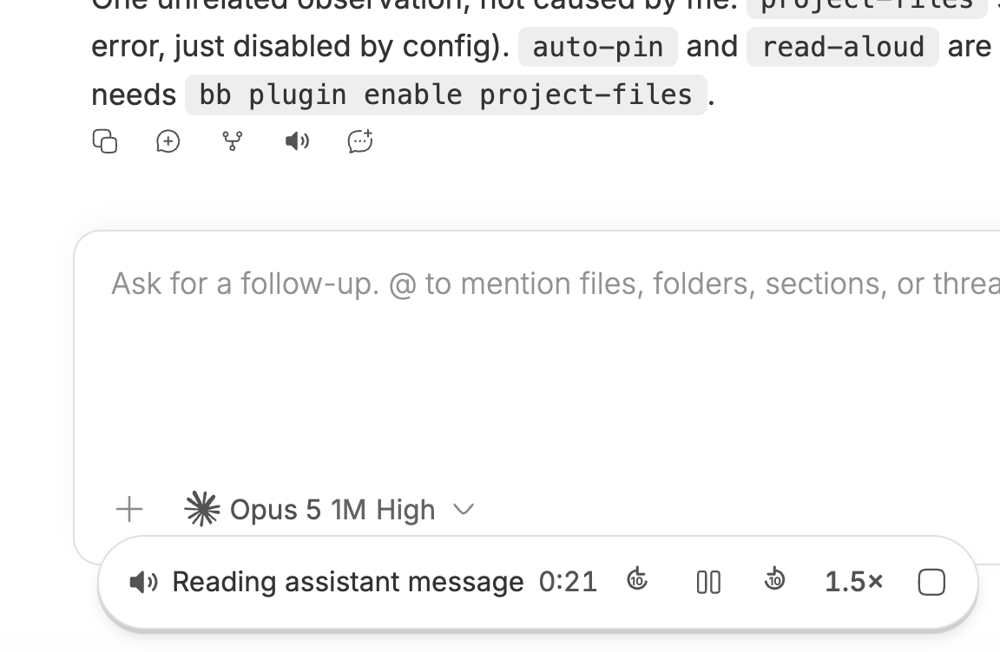

# bb plugins

Personal bb extensions maintained as a multi-plugin repository.

## Project Files

`plugins/project-files` adds a responsive, context-aware file browser to bb.
Open it from a thread's folder action or from **Project Files** in the New Tab
menu. Existing threads browse their exact environment; New Thread follows the
project currently selected in bb. File activation uses bb's native preview and
installed file-opener system.

Install the local checkout:

```sh
bb plugin install path:. --plugin project-files
```

## Auto Pin

`plugins/auto-pin` automatically pins future visible root threads, including
visible root forks. It ignores hidden threads, child threads, and threads that
are already pinned.

```sh
bb plugin install git:https://github.com/csells/bb-plugins.git@main --plugin auto-pin
```

## Read Aloud

`plugins/read-aloud` speaks any chat message with a streaming neural voice,
adding a speaker button to the message action row and a floating transport with
±10s seek, playback speed, pause, and stop. It stops itself when you switch
threads or send a new prompt. Synthesis speaks Microsoft Edge's Read Aloud
protocol directly, so there is no API key, no metering, and no external
binary.



```sh
bb plugin install git:https://github.com/csells/bb-plugins.git@main --plugin read-aloud
```

## Fat Fingers

`plugins/fat-fingers` makes every icon 50% larger when bb is open on a phone,
using the same phone test bb applies to its own coarse-pointer sizing. Desktop
layouts are untouched, and diagrams and images inside messages are left alone.

```sh
bb plugin install git:https://github.com/csells/bb-plugins.git@main --plugin fat-fingers
```

## You Should Know

`plugins/you-should-know` adds a prompt-free second perspective beside a thread.
Open the right panel, then **+ → You should know**. It only adds consequential
points the main agent has not already covered; silence is normal. It reviews on
opening, when work goes idle, and every five minutes during continued activity.
Hiding the panel pauses new reviews; an in-flight review finishes and is saved. Uses subscription-authenticated Codex Sol.

```sh
bb plugin install path:. --plugin you-should-know
```

Development commands:

```sh
npm install
npm run typecheck
npm test
npm run build
```
