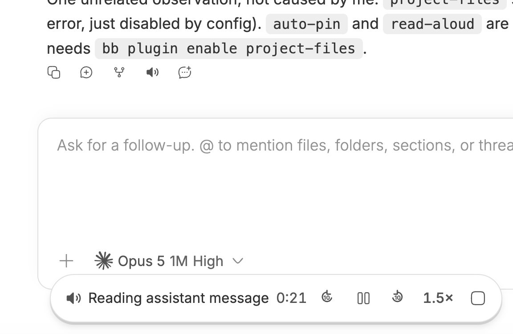

# bb-plugin-read-aloud

Speak any chat message out loud, with a streaming neural voice and a real
transport: seek, speed, pause, stop.

Adds a speaker button to every message's action row.
Click it and a floating pill appears with elapsed time, ±10s seek, pause,
playback speed, and stop.



No API key, no metering, and **no external binary** — synthesis speaks
Microsoft Edge's Read Aloud protocol directly over a WebSocket.

## Install

```bash
bb plugin install <this directory or git url>
```

That is the whole setup. Verify with:

```bash
bb read-aloud status
bb read-aloud voices en-GB     # filter the live voice catalog
```

## Settings

| Setting | Default | Notes |
| --- | --- | --- |
| Voice | `en-US-AndrewMultilingualNeural` | Any Microsoft neural voice |
| Rate | `+8%` | **Synthesis** speed, baked into the audio |
| Code blocks | `describe` | `describe` names the language and line count; `read` speaks it verbatim; `skip` stays silent |
| Client version override | *(empty)* | Advanced; empty negotiates automatically |

Playback speed is separate and lives in `localStorage`: it is a per-device UI
preference you change mid-sentence, whereas plugin settings are server-side,
global, and read once per load.

## How it works

**Native synthesis.** `synth.ts` implements the protocol in about forty lines:
the `Sec-MS-GEC` token (SHA-256 of the current Windows FILETIME rounded to a
five-minute boundary, which must be computed with `BigInt` — the tick count
exceeds `Number.MAX_SAFE_INTEGER` and floating point silently hashes to a
rejected token), the WebSocket handshake, and the binary framing. The only
dependency is `ws`, needed because the browser WebSocket API cannot set the
`Origin`/`User-Agent` headers the service checks.

Earlier versions shelled out to the Python `edge-tts` CLI, which made the
plugin uninstallable for anyone without that virtualenv. The npm ports were not
usable either: `edge-tts-node` pins its client version to Chromium 130 and the
service now refuses that handshake outright (close 1006), while `msedge-tts`
ships a `preinstall: npx only-allow pnpm` hook that aborts any npm install.

**Client-version rot fixes itself.** The service checks
`Sec-MS-GEC-Version` against a *minimum* and enforces no maximum. Measured
directly against the endpoint:

| version | result |  | version | result |
| --- | --- | --- | --- | --- |
| `131.0.0.0` | 403 |  | `143.0.3650.75` | OK |
| `132.0.0.0` | OK |  | `999.0.0.0` | OK |

So the floor sits at 132 while current Edge is ~143 — it ratchets upward but
lags real releases by roughly a year. Because nothing rejects a *higher*
version, a stale pin is always recoverable by escalating. On a refused
handshake the plugin retries with progressively higher majors (+20, +60, +150)
and remembers whatever worked, so the retry cost is paid once per install
rather than once per synthesis. That is why `edge-tts-node`'s hard pin at 130
is permanently broken while this is not. An explicit override is used verbatim
and never escalated, because a version you set deliberately should mean what it
says. `bb read-aloud status` reports which version is live and whether it was
negotiated or pinned.

**Chunked into short turns, synthesized concurrently.** The service will stream
a whole message in one request: bytes per character stay flat at ~362 from 1K
to 12K characters, so nothing is capped or dropped. Throughput is the problem,
and it is nowhere near the ~4.75x realtime this once claimed. Measured end to
end through this route, one turn at a time delivered 274s of audio in 297s of
wall clock — **0.92x realtime, slower than it plays**, in 62 bursts separated
by gaps of up to 7 seconds.

That is the whole bug behind a read that stalls at a fixed point and never
resumes. No prebuffer survives sub-realtime delivery: the client's head start
is spent at a constant rate, and once it is gone playback starves for good.

So the text is split at sentence boundaries and several turns are synthesized
at once, their MP3s concatenated in order. MP3 frames are self-delimiting, so
this needs no stitching and leaves no per-part headers to strip; the client
sees one continuous response and starts playing on the first chunk. Three turns
in flight took the same measurement to **4.07x realtime with 21 gaps**, which
is the headroom the design always assumed it had.

The first chunks are deliberately small (150, then 300 characters, then 400).
Look-ahead buys nothing until the chunk being drained runs out, so a full-size
first chunk would leave the opening minute at ~1x with no lead — the window
where a stall is likeliest. Starting small hands over to an already-buffered
chunk within seconds.

A turn that fails is retried while nothing of it has reached the client, which
buffering ahead makes the common case; a turn that fails after bytes are
downstream is raised rather than swallowed, costing that chunk instead of the
rest of the message.

One measurement trap worth recording: re-reading the *same* text returns at
~112x realtime with a byte-identical body. That is the service serving a cached
synthesis, not a fix working. Benchmark with fresh wording every time.

**Two routes, not one.** `POST /prepare` takes the message text and returns a
job id; `GET /stream?id=` returns `audio/mpeg`. A single GET would be simpler,
but message text runs to tens of thousands of characters and would not survive
a URL.

**Stop genuinely cancels.** Stopping aborts the request, which runs the
stream's `cancel()` and closes the synthesis socket. Stopping a twelve-minute
read costs nothing instead of letting it finish unheard.

**Playback goes through MediaSource,** which exists entirely for seeking.
Pointed straight at a chunked response the browser treats it as live: it
throttles reads to ~2s ahead of the playhead and reports `seekable` as
`[0, Infinity]`, so a 10-second jump either moves about two seconds or sails
past the received audio and resets to zero. Appending every byte as it arrives
makes `buffered` mean what it says — measured 36s of lead versus 2.3s — so a
jump lands exactly and the true edge is knowable. Seeks clamp to that edge;
landing on it starves playback, which surfaces as the "Preparing" state until
more audio arrives. Engines without MSE for mp3 fall back to direct streaming,
where playback works but jumps are smaller.

**Markdown is flattened first.** Raw markdown through a TTS engine says "hash
hash Loose ends" and spells out URLs character by character. Links reduce to
their labels and headings gain a full stop so the voice lands.

Two constructs need more than stripping, because they carry meaning in their
layout and a listener has no layout:

- **Tables** are linearized with every cell paired to its column header, and
  the first column used as the row's label — "Signal. Fixed: HOLD. Risk-based:
  CUT." Flattening a row to "Signal, HOLD, CUT" is wordier to read and
  impossible to follow by ear, since position is the only thing saying which
  value belongs to which column.
- **Code fences** are named rather than read: "(python code block, 12 lines)".
  Braces and indentation are noise aloud, but silence leaves the listener
  unable to judge whether to go and look. Set **Code blocks** to `read` to hear
  the code verbatim, or `skip` for silence.

Fences and tables are found by scanning lines, not by regex over the whole
message: a regex pairs fences positionally, so one stray fence swallows every
word up to the next one. Money and rate shorthand is spoken as words, so
"$120K/yr" comes out as "$120 thousand per year" rather than as letters and a
slash.

**Auto-stop** happens two ways. Switching threads is detected in the overlay
via `useBbContext()`. New prompts go through the backend: `thread.active`
publishes on a realtime channel and the overlay stops, filtered to the thread
being read so background threads never interrupt you. The server-side signal
covers every composer surface and layout, unlike a frontend submit hook.

**Why two registrations.** `messageAction` is host-rendered chrome — `run` is a
plain callback, not a component — so it cannot draw transport buttons as
siblings of itself. The button triggers; `experimental_appOverlay` renders the
transport. A module-level store bridges them, because `run` fires outside React
and the overlay mounts and unmounts underneath it.

## Mobile

Touch targets grow on coarse pointers using BB's own `coarse-pointer-sizing`
classes. The pill clears the mobile composer and respects
`env(safe-area-inset-bottom)`, constrains itself to the viewport width, and
drops its text label first on narrow screens so the controls always fit.

## Known limitations

- **The protocol endpoint is undocumented,** so there is no SLA. Client-version
  rot is handled (see below), but a change to the token scheme itself would
  need a code change, as it would for every client.
- Voice catalog only — no cloning, and no control over the 24kHz/48kbps output
  format.
- Without MSE for mp3, ±10s jumps are limited by how little the browser
  buffers ahead.

## Selection reading

Highlight text inside a message and the action also appears in the selection
menu, reading only what you highlighted.
